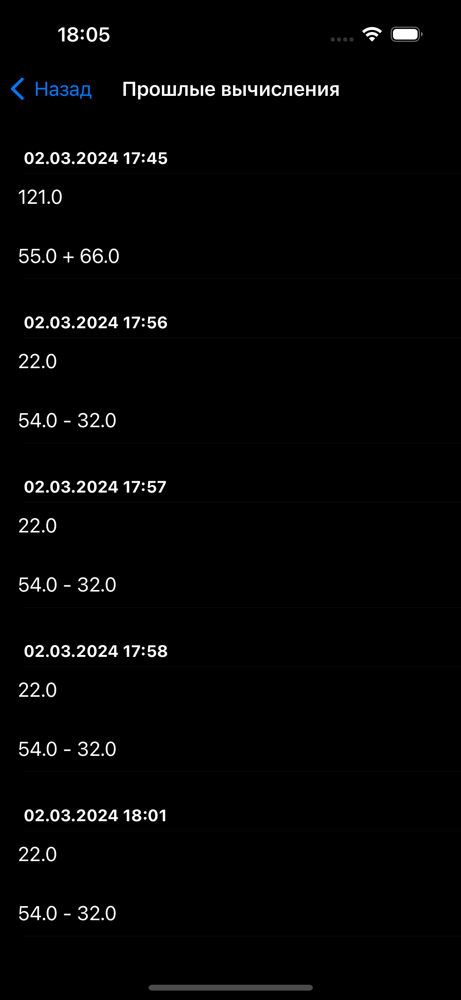
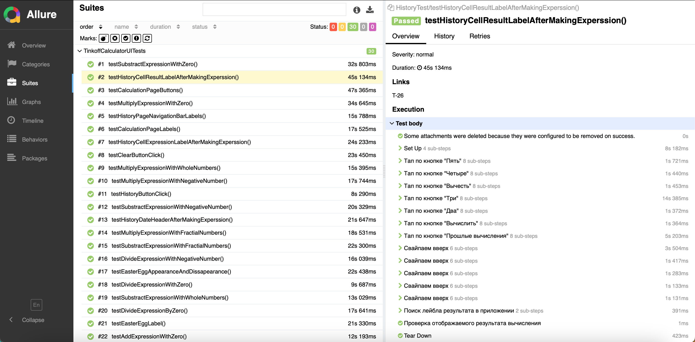

##  Tinkoff Calculator

>Tinkoff Calculator is the demo app of Tinkoff's "iOS for Beginners" course. You can add, subtract, divide and multiply numbers, as well as view the history of past calculations.

## What has been implemented:
* Development
  * MVC
  * UIKit
  * UITableView
  * Auto Layout via Interface Builder
  * User Defaults for persistence
  * Animation via UIViewPropertyAnimator and Core Animation
  * SwiftLint
* Automation
  * Page Object
  * Regression and Smoke test plans
  * 27 UI-Tests via XCUITest
  * 3 Snapshot tests via iOSSnapshotTestCase
  * Fastlane with three parallelized simulators
  * Allure Report with annotations in UI-tests
  * Jenkins

## A little demonstration:

|Manually adding up numbers|XCUITest - Divide by zero|XCUITest - Checking history cell|
|:-:|:-:|:-:|
||||

|Allure Report                                                                                       |
| -------------------------------------------------------------------------------------------------- |
|  |
|  |
